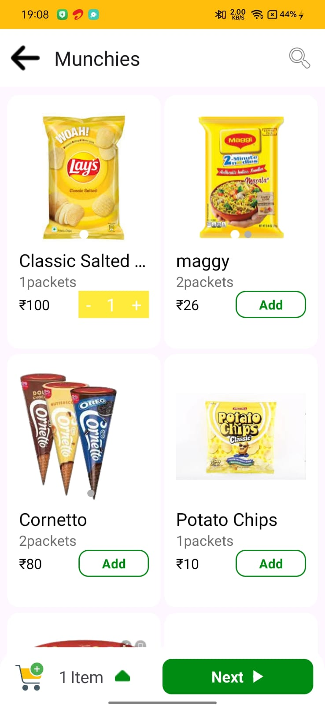
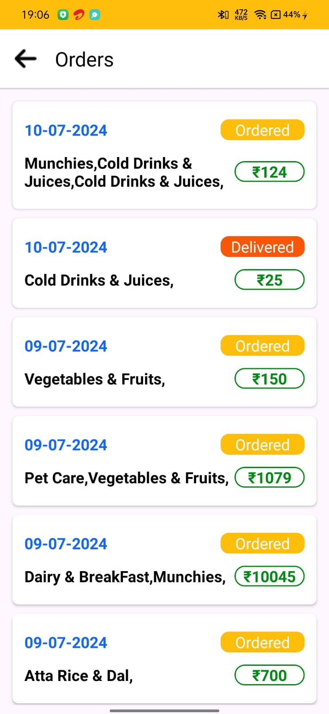
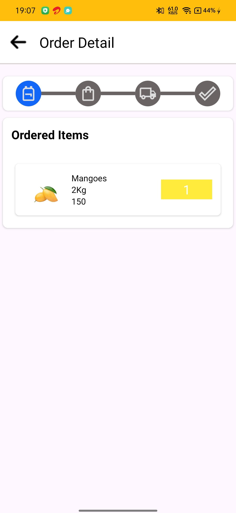

# 📱 Blinkit – Kotlin + XML Android App

---

**Blinkit** is a modern Android application built using **Kotlin** and **XML layouts**, following the **MVVM architecture** pattern.  
It integrates **Firebase Phone Authentication**, **Realtime Database**, and **Storage**, while **Room** provides offline caching and local persistence.

---

## 🖼️ App Preview

| Home | Products | Orders | Orders Detail |
|--------------|---------------|------------|-------------|
|  |  |  |  |

| Home Screen | Quiz Screen | Result | Full Result Questions |
|--------------|---------------|------------|-------------|
|  |  |  |  |

---

## 🚀 Features

| Feature | Description |
|----------|-------------|
| 🔐 **Firebase Phone Authentication** | Secure login and OTP-based verification |
| ☁️ **Firebase Realtime Database** | Live sync of user data and updates |
| 🗂️ **Firebase Storage** | Upload and fetch user media or files |
| 💾 **Room Database** | Offline local storage for caching data |
| 🧠 **MVVM Architecture** | ViewModel, Repository, and LiveData separation |
| 🔄 **LiveData / Flow** | Reactive UI updates |
| 🧩 **RecyclerView Adapter** | Efficient rendering of lists and dynamic content |
| 🎨 **XML Layouts** | Beautiful Material UI with XML |
| ⚡ **Coroutines** | Asynchronous operations made simple |

---

## 🧠 Tech Stack

| Layer | Tool / Library |
|--------|----------------|
| **Language** | Kotlin |
| **UI** | XML Layouts, RecyclerView, Material Components |
| **Architecture** | MVVM (ViewModel + Repository + Flow) |
| **Local Database** | Room |
| **Cloud Backend** | Firebase Realtime Database |
| **Authentication** | Firebase Phone Auth |
| **File Storage** | Firebase Storage |
| **Async Handling** | Coroutines |
| **Build System** | Gradle (KTS) |

---

